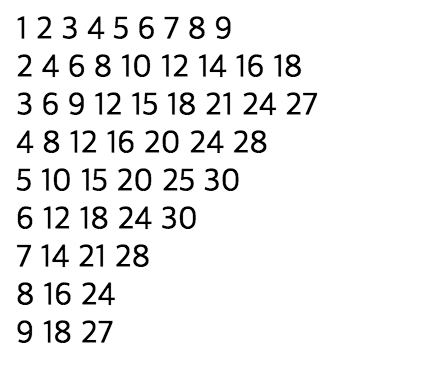
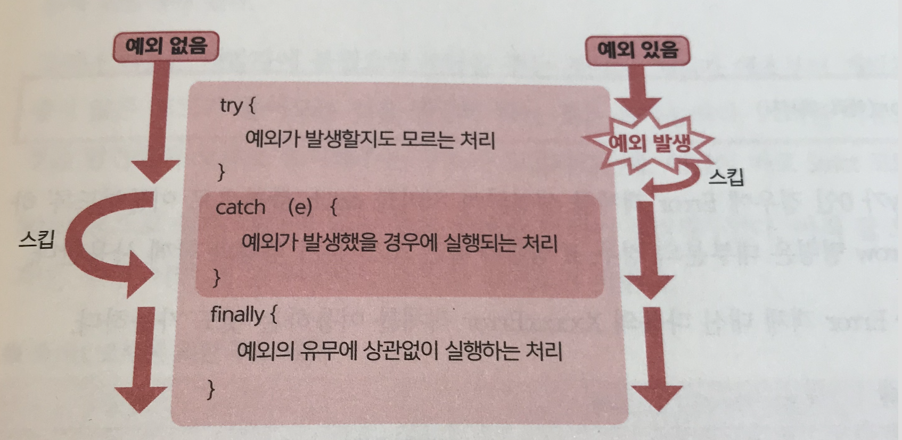

## 연상 배열의 요소를 순서대로 처리하기 - for...in 명령
지금까지 소개한 `for`, `while`/`do...while` 명령과는 약간 종류가 다른 반복 명령이 `for...in` 명령이다. `for...in` 명령은 지정된 연상 배열(객체)의 요소를 추출하여 선두부터 순서대로 처리한다.

```javascript
for ( 가변수 in 연상 배열 ) {
	루프 내에서 실행하는 명령(군)
}
```

가변수는 연상 배열(객체)의 키를 일시적으로 보관하기 위한 변수다. 여기에서 가변수에 보관된 것이 요솟값 그 자체가 아님을 주의해야 한다.

<br/>

**for...in 명령의 동작**
>예를 들어 다음은 연상 배열로부터 요솟값을 순서대로 표시하는 예다.

```javascript
var data - { apple:150, orange:100, banana:120 };
for ( var key in data ) {
	console.log(key + '=' + data[key]);
}

-console-
apple=150
orange=100
banana=120
```

<br/><br/>
###배열에서 for...in 명령은 이용하지 않는다.
---
구문상 배열에서도 `for...in` 명령을 이용하는 것은 가능하다. 

```javascript
var data = [ 'apple', 'orange', 'banana' ];
for ( var key in data ) {
	console.log(data[key]);
} // 결과 : 'apple''orange''banana'를 순서대로 출력
```

<br/>
배열의 내용이 순서대로 출력되어 그냥 보기에는 올바른 동작으로 보인다. 그러나 다음과 같은 코드에서는 어떨까?

```javascript
var data = [ 'apple', 'orange', 'banana' ];
// 배열 객체에 hoge 메소드를 추가
Array.prototype.hoge = function () {} // 1
for ( var key in data ) {
	console.log(data[key]);
} // 결과 : 'apple''orange''banana''function () {}'를 순서대로 출력
```

아직 코드의 자세한 의미는 잘 몰라도 상관없다. 일단 *1* 에서 배열의 기능을 확장시키고 있다는 것만 이해해두길 바란다. 그리고 이로 인해 확장된 기능까지 열거되어 버린다(여기에서는 `function () {}`). 또한 아래와 같은 문제도 있다.

- `for...in` 명령에서는 처리의 순서를 보증하지 않는다.
- 가변수에는 인덱스 번호가 보관될 뿐이므로 코드가 그다지 심플하지 않다(=값 그 자체가 아니므로 오히려 오해를 불러 일으킴).

이러한 이유로 `for..in` 명령은 연상 배열(객채)을 조작할 경우에 한하며, 배열의 조회에는 for명령이나 다음 절에 나올 `for...of` 명령을 이용하도록 하자.

<br/>

```javascript
var data = [ 'apple', 'orange', 'banana' ];
for ( var i = 0, len = data.length; i < len; i++ ) {
	console.log(data[i]);
} // 결과 : 'apple''orange''banana'를 순서대로 출력
```

>이곳의 주제와는 벗어나지만 초기화 식에서 배열의 사이즈(data.length)를 취득하고 있다는 점에 주목해보자. <br/>
>두번째 줄의 코드는 다음과 같이 작성해도 동작한다.

<br/>

```javascript
for ( var i = 0; i < data.length; i++ ) {...}
```

>그러나 루프할 때마다 프로퍼티에 접근해야 하므로 성능은 떨어진다. 대상이 배열이 아니라 NodeList 객체인 경우나 현재는 거의 존재하지 않는 Internet Explorer7 브라우저인 경우에는 그 영향이 뚜렷하게 드러난다.


<br/><br/>

## 배열 등을 순서대로 처리하기 - for...of 명령
배열 등을 순서대로 열거하기 위한 또 하나의 수단으로, ES2015에서 추가된 `for...of` 명령이 있다. '배열 등'이라는 표현을 썼는데, 이렇게 표현한 이유는 `for...of` 명령에서는 배열뿐만 아니라 Array와 같은 객체(NodeList, arguments 등), 반복자/생성자 등도 처리할 수 있기 때문이다. 이를 모두 통틀어서 **열거 가능한 객체** 라고도 부른다.

```javascript
for ( 가변수 of 열거 가능한 객체 ) {
	루프 내에서 실행하는 명령(군)
}
```
구문은 `for..in` 명령과 거의 같으므로 곧바로 구체적인 예를 살펴보자.
<br/>

```javascript
var data = [ 'apple', 'orange', 'banana' ];
Array.prototype.hoge = function () {}
for ( var value of data ) {
	console.log(value);
} // 결과 : 'apple''orange''banana'를 순서대로 출력
```

확실히 배열 data의 내용이 올바로 출력되어 있음을 확인할 수 있다.<br/>
또한 `for...in` 명령에서는 가변수에 키명(인덱스 변호)이 건네진 것에 반해, `for...of`명령에서는 값을 열거하고 있다는 점이 주목할 만한 부분이다.

<br/><br/>
## 루프를 도중에 스킵/중단하기 - break/continue 명령
일반적으로 `while`/`do...while`, `for...in` 명령은 미리 정해진 종료 조건을 만족하는 타이밍에 루프를 종료하지만, '특정 조건을 만족하는 경우에 루프를 강제적으로 둥간하고 싶은'경우도 있다. 이럴 때 이용할 수 있는 것이 앞서 `switch` 명령에서 등장한 `break` 명령이다.
<br/>

```javascript
var result = 0;
for ( var i = 1; 1 <= 100; i++ ) {
	result += i;
	if ( result > 1000 ) { break; }
}
console.log('합계값이 1000을 넘은 것은 ' + i); // 결과 : 합계값이 1000을 넘은 것은 45
```

여기에서는 변수 i를 1 ~ 100 사이에서 더해나가 합계(변수 result)가 1000을 넘을 때 루프를 빠져나오고 있다. 이렇듯 `break` 명령은 `if` 명령과 함께 사용하는 것이 일반적이다.


<Br/><br/>
한편 루프를 완전히 중단해버리는 것이 아니라, '현재의 루프만을 건너뛰고 다음 루프를 계속해서 실행하고 싶은' 경우에는 `continue` 명령을 사용한다. 아래의 코드는 변수 i를 1~100 사이에서 홀수만 더해 그 합계를 구하는 예제다.

```javascript
var result = 0;
for ( var i = 1; i < 100; i++ ) {
	if ( i % 2 === 0 ) { continue; }
	result += i;
}
console.log('합계:' + result); // 결과: 합계:2500
```

여기에서는 카운터 변수 i가 짝수(변수 i가 2로 완전히 나누어짐)인 경우에만 처리를 건너뜀으로써 홀수만의 합계를 구하고 있다.

<br/><br/>

### 중첩된 루프 한 번에 빠져 나오기 - 레이블 구문
---
중첩된 루프 안에서 `break` 또는 `continue` 명령을 사용할 경우, 디폴트로 가장 안쪽의 루프를 탈출하거나 스킵(skip)한다.

```javascript
for ( var i = 1; i < 10; i++ ) {
	for ( var j = 1; j <10; j++ ) {
		var k = i * j;
		if( k > 30 ) { break; }
		document.write(k + '&nbsp');
	}
	document.write('<br/>');
}
```



>여기서는 변수 K(카운터 변수 i, j의 곱셈값)가 30이 넘는 경우에 break 명령을 실행하고 있다. 이로 인해 안쪽 루프만을 빠져 나오고 있으므로 결과적으로 '곱셈값이 30 이하의 값만을 표시하는 구구단'을 생성하게 된 것이다.

<br/><br/>

**document.write 보다 testContext/InnerHTML을 우선한다**
>document.write는 페이지에 지정된 문자열을 출력하기 위한 명령이다. 이전의 Javascript에서는 자주 사용되던 메소드였다. 하지만 '도큐먼트를 모두 출력한 후에 호출하는 경우에는 페이지가 일단 클리어되어버린다'는 등 약간 특수한 동작을 지닌 메소드다. 여기에서는 단순화하기 위해서 일부러 이용하고 있지만, 실제 애플리케이션에서는 textContext/InnerHTML 등의 명령을 우선해서 이용하길 바란다.

이것을 '한 번 곱셈값이 30을 넘으면, 구구단 출력 자체를 정지시키도록' 만들고 싶다면, 어떻게 하면 좋을까.

```javascript
kuku:
for ( var i = 1; i < 10; i++ ) {
	for ( var j = 1; j < 10; j++ ) {
		var k = i * j
		if ( k > 30 ) { break kuku; }
		document.write(k + '&nbsp');
	}
	document.write('<br/>');
}
```


이렇게 빠져 나오고자 하는 루프의 선두에 레이블을 지정하면 된다. 레이블은 아래와 같은 형식으로 지정한다.

`레이블명: `

레이블명은 임의로 부여할 수 있다. 그 다음에는 `break`/`continue` 명령에도 아래와 같이 레이블을 지정함으로써, 이번에는 (안쪽의 루프가 아닌) 레이블이 부여된 루프를 탈출할 수 있다.

`break 레이블명;`

<br/>

**루프 안의 switch 명령**
> 루프 안에서 switch 명령을 이용하는 경우 주의가 필요하다. switch 명령 안에서 break 명령을 이용한다해도 그것은 'switch 명령을 빠져 나온다'라는 의미만을 갖고 있기 때문이다. switch 명령을 감싸고 있는 루프로부터 빠져 나오기 위해서는 레이블 구문을 이용해야만 한다.


<br/><br/>

## 예외 처리하기 - try...catch...finally 명령
>애플리케이션을 실행하다 보면 '숫자를 취할 것이라고 생각했던 함수에 문자열이 건네진 경우', '변수를 참조하려고 했으나 미정의였던 경우'등 프로그래밍 시에는 생각하지 못했던 여러 가지 오류(예외)가 발생하곤 한다.<br/>
물론 예외의 종류에 따라 프로그래밍을 할 때 미연에 방지할 수 있는 것도 있지만, '인수에 예기치 못한 값이 건네졌다', '함수나 클래스가 의도하지 않은 방법으로 사용되었다' 등 외부 요인에 의존하는 처리인 경우에는 예외의 발생을 완전히 막을 수 없다.<br/>
그러한 경우에도 스크립트 전체가 정지해버리는 일이 없도록 하는 것이 예외 처리의 역할이다. 이 예외 처리를 실현하는 명령이 `try...catch...finally` 명령이다.

```javascript
try {
	예외가 발생할지 모를 명령(군)
} catch (예외정보를 취할 변수) {
	예외가 발생했을 시의 명령(군)
} finally {
	예외의 유무에 관계없이 최종적으로 실행되는 명령(군)
}
```

<br/><br/>

구체적인 코드를 살펴보자.

```javascript
var i = 1;
try{
	i = i * j; // 1: 예외 발생
} catch(e) {
	console.log(e.message);
} finally {
	console.log('처리가 완료되었다.');
}

-console-
j is not defined
처리가 완료되었다.
```

> 만일 `try...catch...finally` 명령을 이용하지 않았다면 *1* 의 시점에서 예외(미정의 변수를 참조하려 했기 때문)가 발생하여 스크립트가 정지되었을 것이 틀림없다. 그러나 try 블록에서 예외가 발생했을 경우, 처리는 그래도 catch 블록에 인도되어 후속의 *2* 도 제대로 처리되는 것을 확인할 수 있을 것이다. <br/>
finally 블록은 불필요한 경우에 생략해도 상관없다.

참고로, 에러 정보는 catch 블록의 Error 객체로(여기에서는 변수 e) 인도된다. 여기서는 Error 객체에 준비되어 있는 message 프로퍼티를 사용하여 에러 메세지를 표시하고 있을 뿐이지만, 그 외의 블록과 동일하게 필요에 따라서 임의의 처리를 기술할 수 있다.

