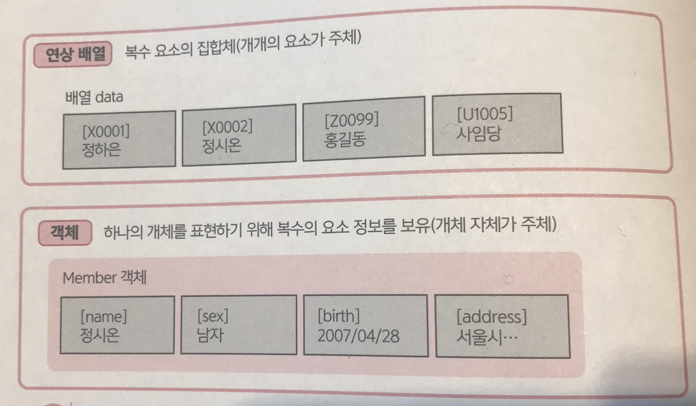
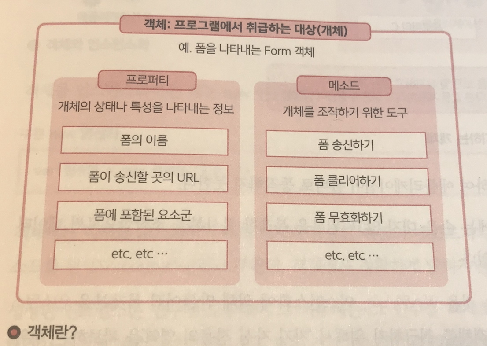
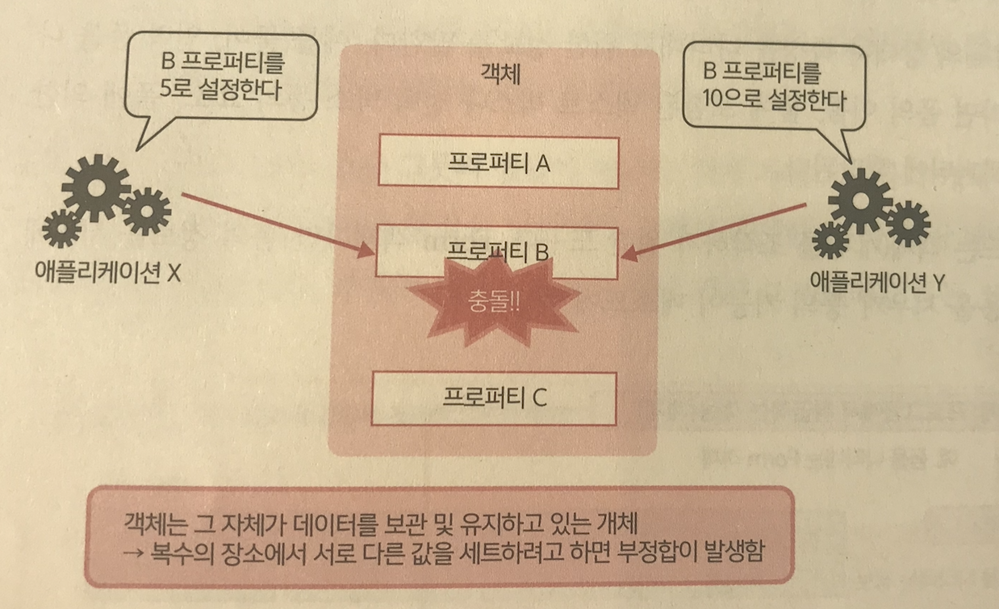
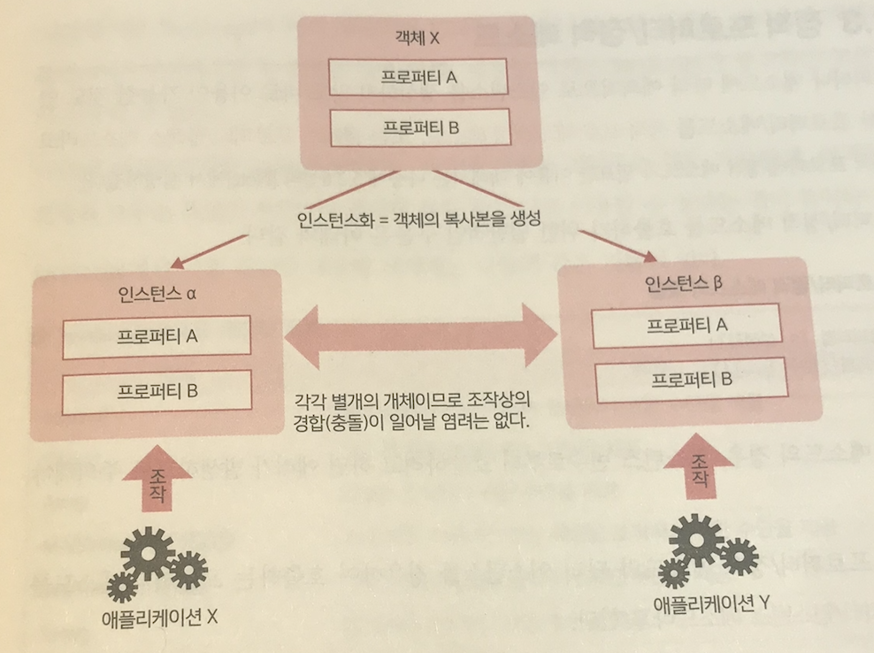
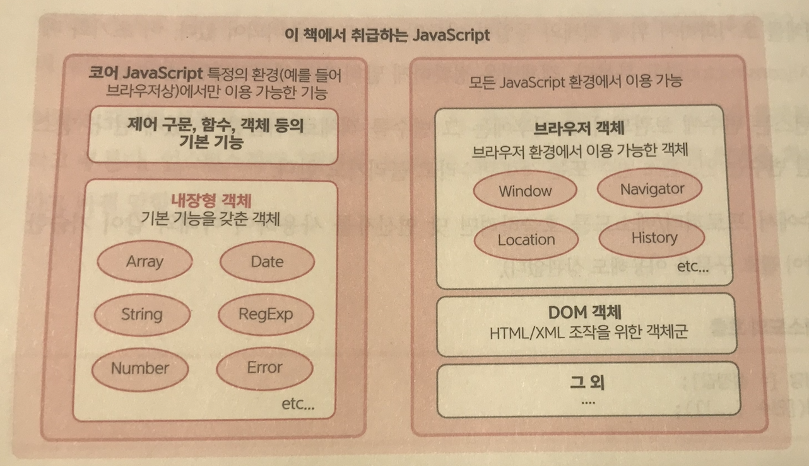
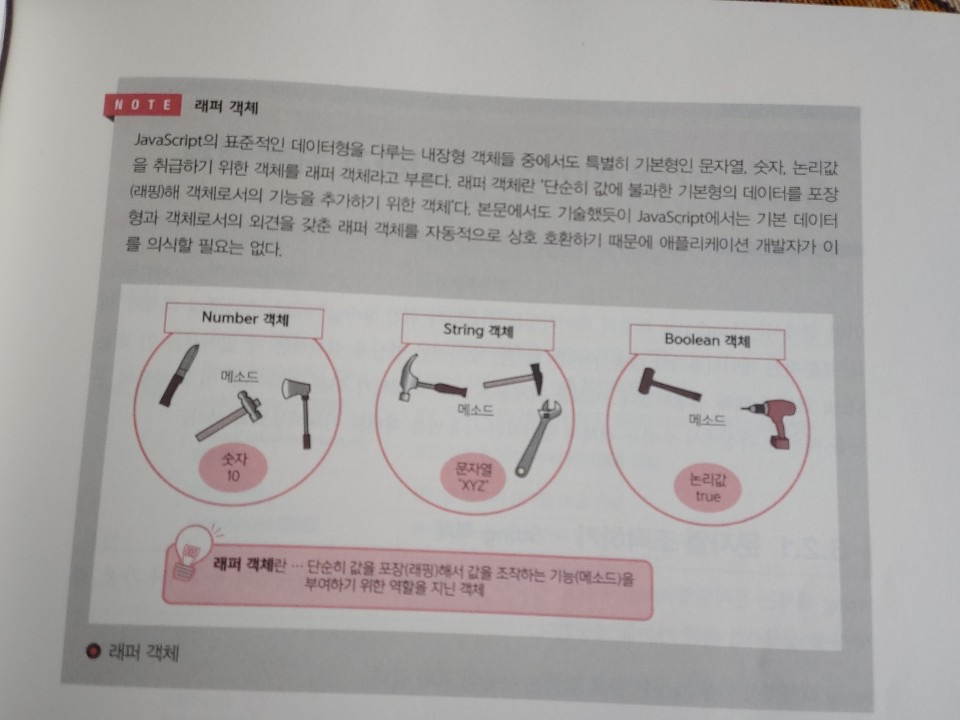

# 객체란?
객체란 단순히 이름이 붙은 그릇의 집합이 아니다. 객체 자체가 하나의 개체이며, 내부에 포함된 요소는 그 개체의 특성이나 동작을 나타내기 위해서 존재한다. 즉 (연상 배열이 아닌) '객체'라는 단어를 사용하는 경우, 주체는 개개의 요소가 아닌 개체 그 자체라고 하는 것이 좋을 듯 싶다.
>
>```
>Javascript의 경우, 구문상으로는 연상 배열도 객체도 동일한 방식으로 이름이 부여된 배열이다.
>그러나 언어상의 관점으로 사용을 분류할 경우에는 각각의 의미가 전혀 다르다.
>```



프로그램상에서 취급하는 대상을 객채(개체)로 생각해서 그렇게 만들어진 객체를 중심으로 코드를 조립해 나가는 수법을 **객체지향** 이라고 부른다. 객체지향 언어로 유명한 언어는 Java나 C#, Ruby 등이 있으며 JavaScript도 그 중 하나다.

<br/><br/>

## 객체 = 프로퍼티 + 메소드
>객체는 프로퍼티와 메소드로 구성되어 있다.<br/>
프로퍼티란 '객체(개체)의 상태나 특성을 나타내기 위한 정보'를 말한다. 예를 들어, 입력 폼을 나타내는 Form 객체라면 폼의 이름, 폼에 포함된 텍스트 박스나 선택 박스 등의 요소, 폼에 의한 송신 장소 등이 프로퍼티에 해당된다.<br/>
이에 반하여, 메소드는 객체(개체)를 조작하기 위한 도구다. Form 객체라면 '폼의 정보를 서버에 송신하기', '폼의 내용 지우기' 등의 기능이 메소드에 해당된다.



프로퍼티/메소드라는 관점에서 봤을 때 객체란 '데이터를 조작하기 위해 여러가지 기능을 가진' 고기능의 기릇이라고 할 수 있다.

<br/><br/>

## 객체를 이용하기 위한 준비 - new 연산자
>객체지향의 세계에서는 원래 (나중에 기술할 예외를 제외하고) 준비된 객체를 직접 사용하는 것을 인정하지 않는다. 그도 그럴 것이 객체는 '자기 자신 안에서 데이터를 보존할 수 있다'는 성질을 갖고 있기 때문이다.

예를 들어, 애플리케이션이 특정 개체에 대해 여러 곳으로 서로 다른 목적을 지닌 데이터값을 설정해버리면 어떻게 될까?


<br/>

당연히 데이터가 서로 충돌하여 애플리케이션이 올바로 동작하지 못한다.<br/>

이러한 이유로 객체의 원본에는 손을 대지 않고 '원본을 복제한 복사본'을 조작함으로써 데이터의 경합을 방지하도록 되어 있다.
이렇듯 객체의 복제를 만드는 것을 `인스턴스화`, 인스턴스화에 의해 만들어진 복제본을 `인스턴스`라고 부른다. 인스턴스화란 `객체를 취급하기 위해서 '자기 자신 전용의 영역'을 확보하는 행위`라고 바꿔 말할 수 있다.


<br/>

객체를 인스턴스화하는 데는 **new 연산자** 를 이용한다.

```javascript
var 변수명 = new 객체명([인수,...])
```

<br/><br/>
객체에는 객체를 초기화하기 위해 객체와 동일한 이름의 메소드가 준비되어 있다. 이 초기화 메소드를 **생성자(constructor)** 라고 부른다. 객체명은 정확하게 말하자면 생성자명인 셈이다. 생성된 인스턴스는 변수에 보관되어 그 이후에는 그 변수를 객체로 취급할 수 있게 된다. 인스턴스가 보관된 변수는 **인스턴스 변수** 또는 **객체 변수** 라고 불리기도 한다.<br/>
인스턴스 변수에서 프로퍼티/메소드를 호출하려면 닷 연산자를 사용하여 아래와 같이 기술한다.

```
변수명.프로퍼티명 [= 설정값];
변수명.메소드명([인수 [,...]]);
```

<Br/><br/>

## 정적 프로퍼티/정적 메소드
>단, 프로퍼티나 메소드에 따라 예외적으로 인스턴스를 생성하지 않고 바로 이용이 가능한 것도 있다. 이러한 프로퍼티/메소드를 **정적 프로퍼티/정적 메소드**, 또는 **클래스 프로퍼티/클래스 메소드** 라고 부른다.

<br/>
정적 프로퍼티/정적 메소드를 호출하기 위한 일반적은 구문은 아래와 같다.

```
객체명.프로퍼티명 [= 설정값];
객체명.메소드명([인수 [,...]]);
```

이러한 정적 메소드의 경우, 인스턴스 변수로부터 호출하려고 하면 에러가 발생하므로 주의해야한다.<br/>
참고로, 정적 프로퍼티/정적 메소드와 달리 `인스턴스를 경유하여 호출하는` 프로퍼티/메소드를 **인스턴스 프로퍼티/인스턴스 메소드** 라고 한다.

<br/><br/>

## 내장형 객체란?
Javascript에는 많은 객체가 공개되어 있는데, 그중에서도 가장 기본적인 것이 **내장형 객체(Built-in Object:빌트인 오브젝트)** 다.



'내장형'이란 'Javascript에 미리 내장되어 있다'는 의미다. 앞으로 등장할 브라우저 객체가 특정 환경(브라우저상)에서만 동작하는 것에 반해, 내장형 객체는 Javascript가 동작하는 모든 환경에서 이용할 수 있다. Javascript에서는 자신이 객체를 정의하는 것도 가능한데, 이러한 내장형 객체의 경우는 특별한 선언이나 정의를 하지 않고 바로 이용할 수 있다는 점이 특이하다.<br/>

<br/><br/>

Javascript에서 이용 가능한 내장형 객체에는 다음과 같은 것들이 있다.

|객체|개요|
|:----:|:----:|
|(Gloval)| Javascript의 기본 기능에 접근하기 위한 수단을 제공 |
|Object| 모든 객체의 모형이 되는 기능을 제공 |
|Array|배열을 조작하기 위한 수단을 제공|
|MAP/WeakMAP|키/값으로 이루어진 연상 배열을 조작하기 위한 수단을 제공|
|Set/WeakSet|고유한 값의 집합을 관리하기 위한 수단을 제공|
|String|문자열을 조작하기 위한 수단을 제공|
|Boolean|참/거짓 값을 조작하기 위한 수단을 제공|
|Number|숫자를 조작하기 위한 수단을 제공|
|Function|함수를 조작하기 위한 수단을 제공|
|Symbol|심벌을 조작하기 위한 수단을 제공|
|Math|수치 연산을 실행하기 위한 수단을 제공|
|Date|날짜를 조작하기 위한 수단을 제공|
|RegExp|정규 표현에 관한 기능을 제공|
|Error/XxxxxError|에러 정보를 관리|
|Proxy|객체의 동작을 커스터마이즈하는 수단을 제공|
|Promise|비동기 처리를 구현하기 위한 수단을 제공|

<br/>
주의 깊은 사람이라면 이 중에서 Object, Array, String, Boolean, Number, Symbol, Function까지는 이미 소개한 데이터형에 해당하고 있다는 점을 눈치챘을 것이다. 여기서 String 객체의 Length 프로퍼티를 이용해 문자열의 길이를 구하는 예를 살펴보자.

```javascript
var str = '안녕하세요!';
console.log(str.length); // 문자열 길이를 취득 (결과는 6)
```

<br/>
앞서 기술했듯이 객체를 이용하려면 `인스턴스화`라는 절차를 밟아야 할 필요가 있다. 그러나 Javascript에서는 리터럴을 그대로 대응하는 내장형 객체로 이용할 수 있으므로 인스턴스화를 거의 의식할 필요가 없다.


<br/><br/>

### 기본 데이터형에서는 New 연산자를 사용하지 않는다.
---
물론 기본 데이터형이라도 new 연산자를 사용하여 명시적으로 객체를 생성할 수 있다.

```javascript
var str = new String('안녕하세요!');
```

하지만 거의 대부분의 경우, 장황하기만 하고 오히려 유해한 경우가 많다. 예를 들어 다음과 같은 경우를 살펴보자.

```javascript
// 원래는 [var flag = false;]라고 써야한다.
var flag = new Boolean(false);

if (flag) {
	console.log('flag는 true입니다!');
}  // 결과 : flag는 true입니다!
``` 
<br/>

변수 flag의 값이 false임에도 불구하고 Boolean 생성자로 생성한 객체는 무조건 true로 간주하고 있다. 이것은 Javascript가 `null 이외의 객체를 true로 간주한다`는 이유로 발생하는 문제다. 물론 이것은 의도한 동작이 아니므로 이러한 기술은 피해야한다. 반복하겠다.
**기본 데이터형을 new 연산자를 사용하여 인스턴스화하는 것은 원칙적으로 피해야 한다.** <br/>

그럼, 이제 이들 내장형 객채에 대해서 개별적으로 설명하겠다. <br/>
Boolean 객체는 참/거짓값에 객체로서의 형태를 부여하기 위한 편의적인 래퍼 객체로, 그 자체가 특별하게 독자적인 기능을 제공하지 않기 때문에 설명하지 않겠다.

