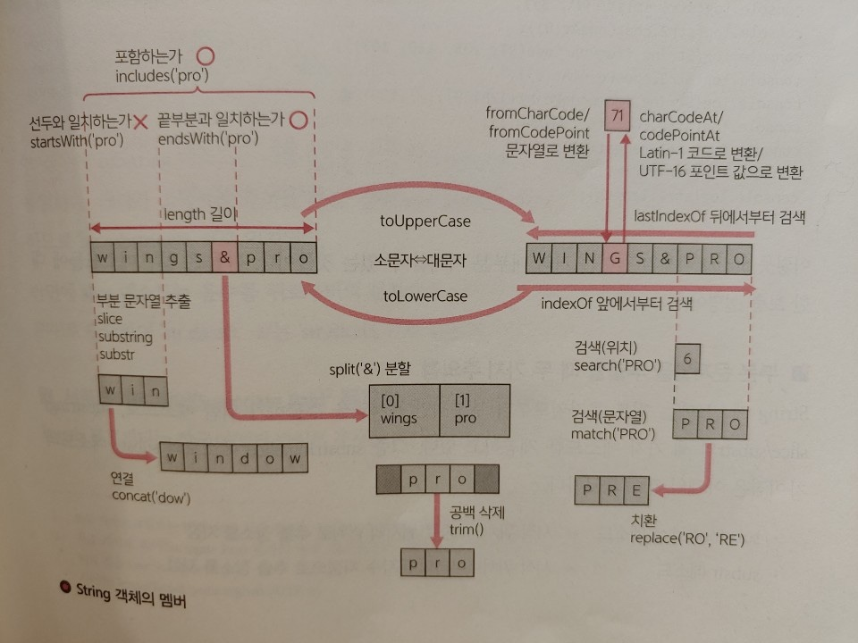

# 기본 데이터를 취급하기 위한 객체

 
## 문자열 조작하기 - String 객체
String 객체는 문자열형(string)의 값을 취급하기 위한 래퍼 객체다. 문자열의 유출이나 가공, 검색 등을 실시하기 위한 기능을 제공한다.

String 객체에서 이용 가능한 주요 멤버는 다음의 표와 같다.

* 검색

|멤버|개요|
|:---:|:---:|
|indexOf(substr, [,start])| 문자열 전방(start + 1번째 문자)부터 부분 문자열 substr을 검색 |
|lastIndexOf(substr, [,start])| 문자열 후방(start + 1번쨰 문자)부터 부분 문자열 substr을 검색 |
|startsWith(search [,pos])| 문자열이 지정된 부분 문자열 search로 시작하는가(인수 pos는 검색 시작 위치) |
|endsWith(search [,pos])| 문자열이 지정된 부분 문자열 search로 종료하는가 |
|includes(search [,pos])| 문자열이 저징된 부분 문자열 search를 포함하는가 |

* 부분 문자열

|멤버|개요|
|:---:|:---:|
|charAt(n)| n + 1번째의 문자를 추출 |
|slice(start [,end])| 문자열부터 start + 1~end번째 문자를 추출 |
|substring(start [,end])| 문자열부터 start + 1~end번째 문자를 추출 |
|substr(start [,cnt])| 문자열부터 start + 1번째 문자부터 cnt 수만큼의 문자를 추출 |
|split(str [,limit])| 문자열을 분할 문자열 str로 분할하여 그 결과를 배열로 취득(인수 limit는 최대 분할수)|

* 정규 표현

|멤버|개요|
|:---:|:---:|
|match(reg)| 정규 표현 reg로 문자열을 검색, 일치한 부분 문자열을 취득 |
|replace(reg, rep)| 정규 표현 reg로 문자열을 검색, 일치한 부분을 부분 문자열 rep로 치환 |
|search(reg)| 정규 표현 reg로 문자열을 검색, 일치한 맨 처음 문자 위치를 취득 |

* 대문자 <=> 소문자

|멤버|개요|
|:---:|:---:|
|toLowerCase()| 소문자로 치환 |
|toUpperCase()| 대문자로 치환 |

* 코드 변환(#은 정적 메소드)

|멤버|개요|
|:---:|:---:|
|charCodeAt(n)| n + 1번째 문자를 Latin-1 코드로 변환 |
| #fromCharCode(c1, c2...)| Latin-1 코드 c1, c2... 를 문자로 변환 |
|codePointAt(n)| n + 1번째의 문자를 UTF-16 인코딩된 코드 포인트값으로 변환 |
| #fromCodePoint(num, ...)| 코드 포인트값으로부터 문자열을 생성 |

* 그 외

|멤버|개요|
|:---:|:---:|
|concat(str)| 문자열 뒤쪽에 문자열 str을 연결 |
|repeat(num)| 문자열을 num 숫자만큼 반복한 것을 취득 |
|trim()| 문자열의 전후에서 공백을 삭제 |
|length| 문자열의 길이를 취득 |

