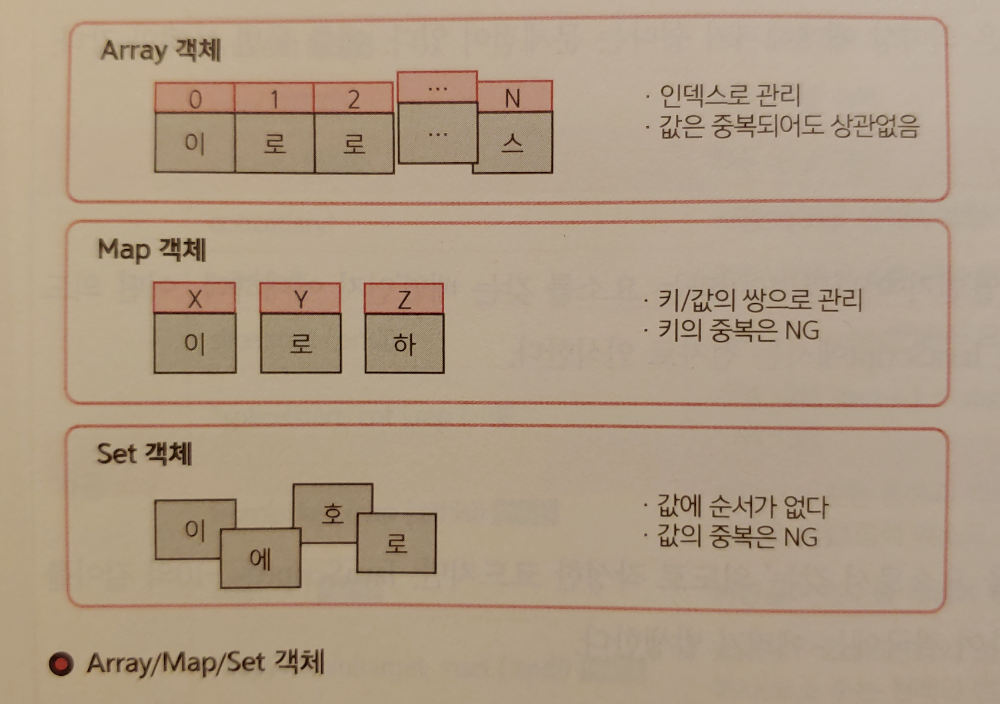
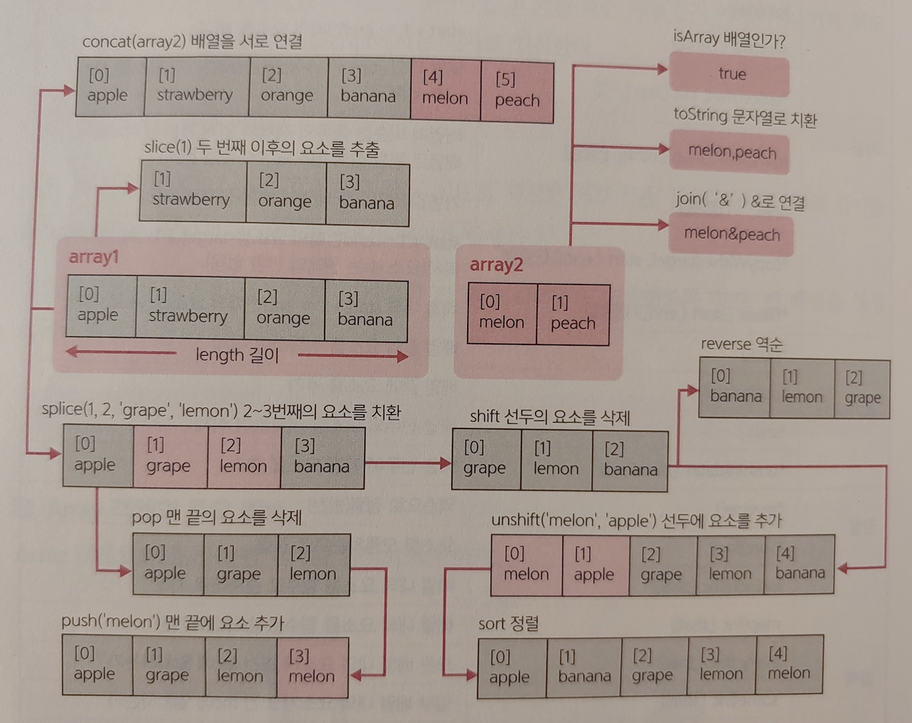
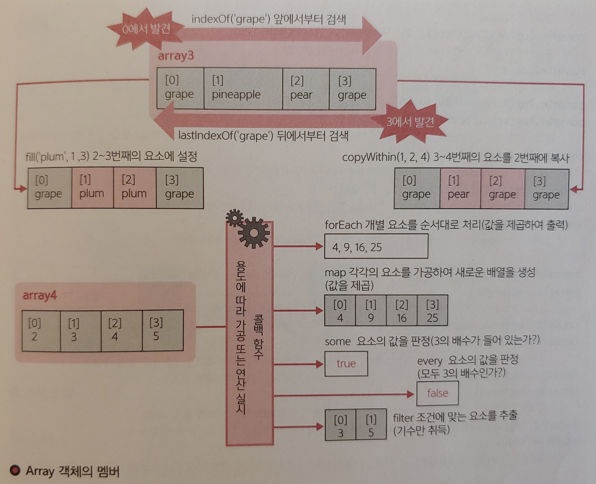
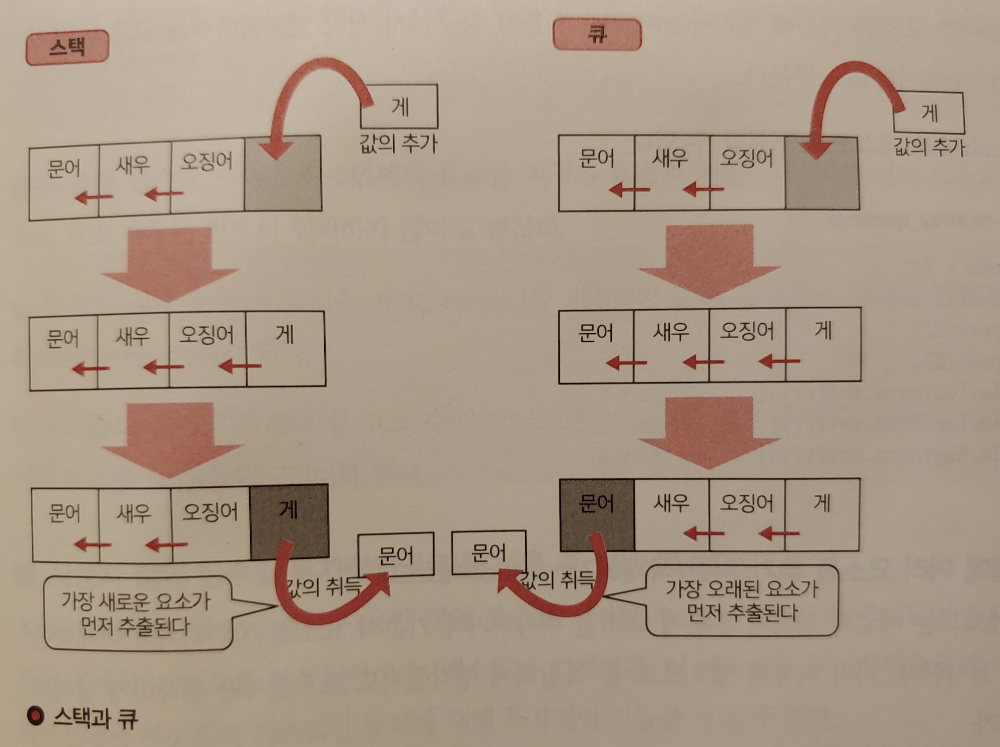

# 값의 집합을 처리/조작하기 - Array/Map/Set 객체

JavaScript에서는 값의 집합을 조작하기 위한 객체로 다음과 같은 객체를 제공하고 있다.



Array 객체는 일반적인 배열을 취급하기 위한 객체로, JavaScript의 초기부터 제공되고 있는 전통적인 객체다.

한편 Map/Set 객체는 ES2015에서 추가된 것이다. 지금까지의 JavaScript에서는 연상 배열(맵)을 객체 리터럴로 대신해서 사용하던 것이 관용적이었다. 그러므로 ES2015를 이용할 수 있는 환경에서는 각자의 장점과 단점을 잘 이해해 나누어 사용할 필요가 있다. 

<br/><br/>

## 배열 조작하기 - Array 객체
그럼, 우선 Array 객체부터 살펴보자. Array 객체는 배열형의 값을 취급하기 위한 객체로, 배열에 대한 요소의 추가/삭제, 결합, 정렬 등을 행하기 위한 기능을 제공한다.

Array 객체는 리터럴 표현을 사용하여 아래와 같이 생성할 수도 있다.

```javascript
var ary = ['배트맨', '슈퍼맨', '아쿠아맨'];
```

또한 생성자 경유로 다음과 같이 생성하는 것도 가능하다.

```javascript
var ary = new Array('배트맨', '슈퍼맨', '아쿠아맨'); // 지정 요소로 배열을 생성
var ary = new Array(); // 빈 배열을 생성
var ary = new Array(10); // 지정 사이즈(인덱스는 0~9)로 빈 배열을 생성
```

단, 생성자를 이용한 구문은 의미상 애매해지기 쉽다는 문제점이 있다. 예를 들면 아래와 같다.

```javascript
var ary = new Array(10);
```

위 구문은 '길이가 10인 배열'인지 아니면 '10이라는 요소를 갖는 배열'인지 애매하다. 어떤 의도로 작성했는지는 모르지만, JavaScript에서는 전자로 인식한다.

```javascript
var ary = new Array(-10);
```

또한, 바로 위 예제는 '-10을 요소로서 갖는'의도로 작성한 코드지만,JavaScript는 '-10의 길이를 갖는 배열'을 생성하려고 하여 결국에는 에러가 발생한다.

이러한 이유로, 배열을 생성할 때는 가능한 한 배열 리터럴을 이용하도록 하자. 빈 배열을 생성하려면 다음과 같이 기술한다.

```javascript
var ary = [];
```

<br/><br/>

### Array 객체의 주요 멤버
---

1. 기본

|No.| 멤버 | 개요 |
|:----:|----|----|
|1|length|배열의크기
|2|isArray(obj)|지정한 객체가 배열인가(정적 메소드)|
|3|toString()|'요소, 요소, ...'의 형식으로 문자열 변환|
|4|toLocaleString()|배열을 문자로 변환(구분 문자는 로케일에 따라 계획)|
|5|indexOf(elm [,index])|지정한 요소와 일치한 첫 요소의 키를 취득(index는 검색 시작 위치)|
|6|entries()|모든 키/값을 취득|
|7|keys()|모든 키를 취득|
|8|values()|모든 값을 취득|


2. 가공

|No.| 멤버 | 개요 |
|:----:|----|----|
|1|concat(ary)|지정 배열을 현재의 배열에 연결|
|2|join(del)|배열 내의 요소를 구분 문자 del로 연결|
|3|slice(start [,end])|start + 1~ end번째의 요소를 빼냄|
|4|\*splice(start, cnt [,rep [,...]])|배열 내의 start + 1 ~ start + cnt번째의 요소를 rep, ...로 치환|
|5|from(alike [,map [,othis]])|배열과 비슷한 종류의 객체와 열거 가능한 객체를 배열로 변환(정적 메소드)|
|6|of(e1, ...)|가변길이 인수를 배열에 변환(정적 메소드)|
|7|\*copyWithin(target, start [,end])|start + 1 ~ end번째의 요소를 target + 1번째 위치부터 복사(요소 수는 원래와 변함 없음)|
|8|fill(var [,start [,end]])|배열 내의 start + 1 ~ end번째의 요소를 var로 치환|

3. 추가/삭제

|No.| 멤버 | 개요 |
|:----:|----|----|
|1|\*pop()|배열 끝의 요소룰 취득하여 삭제|
|2|\*push(data)|배열 끝에 요소를 추가|
|3|\*shift()|배열 선두의 요소를 취득하여 삭제|
|4|\*unshift(data1 [,data2,...\)|배열 선두에 지정 요소를 추가|

4. 정렬

|No.| 멤버 | 개요 |
|:----:|----|----|
|1|\*reverse()|역순으로 정렬(반전)|
|2|\*sort([fnc])|요소를 오름차순을 정렬|

5. 콜백

|No.| 멤버 | 개요 |
|:----:|----|----|
|1|fotEach(fnc [,that])| 배열 내의 요소를 함수로 순서대로 처리|
|2|map(fnc [,that])| 배열 내의 요소를 함수로 순소대로 가공|
|3|every(fnc [,that])|모든 배열 내의 요소가 조건 fnc에 일치하는가|
|4|some(fnc [,that])|일부 배열 내의 요소가 조건 fnc에 일치하는가|
|5|filter(fnc [,that])|조건 fnc에 일치한 요소로 배열을 생성|
|6|find(fnc [,that])|함수 fnc가 처음 true를 반환한 요소를 취득|
|7|findIndex(fnc [,that])|함수 fnc가 처음 true를 반환한 요소의 인덱스 번호를 취득|
|8|reduce(fnc [,init])|바로 옆의 두 요소를 왼쪽부터 오른쪽의 함수 fnc로 처리하여 단일 값으로 한다(인수 init는 초기값)|
|9|reduceRight(fnc [,init])|바로 옆의 두 요소를 오른쪽부터 왼쪽으로 함수 fnc로 처리하여 단일 값으로 한다(인수 init는 초기값)|

<Br/>

> **파괴적인 메소드**<br/>
> 파괴적인 메소드란 그 실행에 의해 객체(여기서는 배열) 그 자체에 변경을 미치는 메소들 말한다. 예를 들어 reverse/sort 등의 메소드는 반환값이 정렬 후의 배열을 반환하는데, 원래의 배열도 정렬되므로 주의가 필요하다.

<br/>




<br/><br/>

> **array**<br/>
> 
>```javascript
>var ary1 = ['Sato', 'Takae', 'Osada', 'Hio', 'Saitoh', 'Sato'];
>var ary2 = ['Yabuki', 'Aoki', 'Moriyama', 'Yamada'];
>
>console.log(ary1.length); // 결과 : 6
>console.log(Array.isArray(ary1)); // 결과 : true
>console.log(ary1.toString()); // 결과 : Sato, Takae, Osada, Hio, Saitoh, Sato
>console.log(ary1.indexOf('Sato')); // 결과 : 0
>console.log(ary1.lastIndexOf('Sato')); // 결과 : 5
>
>console.log(ary1.concat(ary2));
>// 결과 : ["Sato", "Takae", "Osada", "Hio", "Saitoh", "Sato", "Yabuki", "Aoki", "Moriyama" "Yamada"]
>
>console.log(ary1.join('/')); // 결과 : Sato/Takae/Osada/Hio/Saitoh/Sato
>console.log(ary1.slice(1)); 
>// 결과 : ["Takae", "Osada", "Hio", "Saitoh", "Sato"]
>console.log(ary1.slice(1, 2)); // 결과 :  ["Takae"]
>console.log(ary1.splice(1, 2, 'kakeya', 'yamaguchi'));
>// 결과 :  ["Takae", "Osada"] (치환 대상의 요소를 취득)
>console.log(ary1);
>// 결과 :  ["Sato", "Kakeya", "Yamaguchi", "Hio", "Saitoh", "Sato"] (치환 후의 배열)
>console.log(Array.of(20,40,60)); // 결과 : [ 20, 40, 60]
>console.log(ary1.copyWithin(1, 3, 5));
>// 결과 :  ["Sato", "Hio", "Saitoh", "Hio", "Saitoh", "Sato"] (4~5번째 요소를 2~3번째의 위치에 복사)
>console.log(ary1);
>// 결과 :  ["Sato", "Hio", "Saitoh", "Hio", "Saitoh", "Sato"] (복사 후의 배열)
>console.log(ary2.fill('Suzuki', 1, 3)); 
>// 결과 : ["Yabuki", "Suzuki", "Suzuki", "Yamada"] (2~3번째 요소를 "Suzuki"로 치환)
>console.log(ary2);
> // 결과 : ["Yabuki", "Suzuki", "Suzuki", "Yamada"] (치환 후의 배열)
> 
> console.log(ary1.pop()); // 결과 : Sato (삭제한 요소)
>console.log(ary1); // 결과 : ["Sato", "Hio", "Saitoh", "Hio", "Saitoh"] (삭제한 후의 배열)
>console.log(ary1.push('Kondo')); // 결과 : 6 (추가한 후의 요소 수)
>console.log(ary1); // 결과 :  ["Sato", "Hio", "Saitoh", "Hio", "Saitoh", "Kondo"] (추가한 후의 배열)
>console.log(ary1.shift()); // 결과 : Sato(삭제한 요소)
>console.log(ary1); // 결과 : ["Hio", "Saitoh", "Hio", "Saitoh", "Kondo"] (삭제한 후의 배열)
>console.log(ary1.unshift('Ozawa', 'Kuge')); // 결과 : 7 (추가한 후의 요소 수)
>console.log(ary1); 
>// 결과 : ["Ozawa", "Kuge", "Hio", "Saitoh", "Hio", "Saitoh", "Kondo"] (추가한 후의 배열)
>
>console.log(ary1.reverse()); 
>// 결과 : ["Kondo", "Saitoh", "Hio", "Saitoh", "Hio", "Sato", "Kuge", "Ozawa"] (반전 후의 배열)
>console.log(ary1);
>// 결과 : ["Kondo", "Saitoh", "Hio", "Saitoh", "Hio", "Sato", "Kuge", "Ozawa"] 
>console.log(ary1.sort()); 
>// 결과 : [ "Hio",  "Hio", "Kondo", "Kuge", "Ozawa", "Saitoh", "Saitoh"] (정렬 후의 배열)
>console.log(ary1);
>// 결과 : [ "Hio",  "Hio", "Kondo", "Kuge", "Ozawa", "Saitoh", "Saitoh"] 
>```

<br/>

배열의 기본적인 사용법을 이해했으니 다음으로 위의 예제에서 미처 설명하지 못한 메소드에 대해서 보충 설명하겠다.

<br/><br/>

### 스택과 큐
---
push/pop/shift/unshift 메소드를 데이터 구조의 관점으로 보면, 좀 더 심도 있게 이해할 수 있다. 이 메소드를 이용함으로써 배열을 스택/큐로써 이용할 수 있게 된다.



<br/>

1. **스택**

>**스택(Stack)**이란 <U>나중에 들어간 것이 먼저 나오는 구조(LIFO: Last In First Out)</U> 또는 <U>먼저 넣은 것이 나중에 나오는 구조(FILO:First In Last Out)</U>라 불리는 데이터 구조다. 예를 들어 애플리케이션에서 자주 등장하는 **Undo** 기능의 경우, 조작을 이력에 보관해서 마지막에 실행한 조작을 우선 추출한다. 이러한 용도의 조작에는 스택이 적합하다.
> <br/><br/>
>스택은 push/pop 메소드로 구현할 수 있다.

```javascript
var data = [];
data.push(1);
data.push(2);
data.push(3);
console.log(data.pop()); // 결과 : 3
console.log(data.pop()); // 결과 : 2
console.log(data.pop()); // 결과 : 1
```
<br/>

2. **큐**

>**큐(Queue)**란 <U>먼저 넣은 것이 먼저 나오는 구조(FIFO: First In First Out)</U>라고 불리는 데이터 구조다.