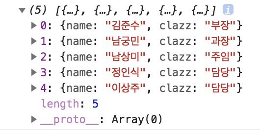

### # 독자적인 규칙으로 배열을 나열하기 - sort 메소드
sort 메소드는 다폴트로 배열을 문자열로 취급하여 사전순으로 정렬한다. 이 규칙을 변경하는데 인수로서 다음과 같은 함수를 정의한다.

- 인수는 2가지(비교할 배열 요소)
- 제1인수가 제2인수보다 작은 경우는 음수, 큰 경우는 양수를 반환한다.

예를 들어 다음은 배열의 내용을 숫자로 정렬하는 예다. 디폴트 동작과 결과의 변화를 비교해 보자.

```javascript
var ary = [5, 25, 10];
console.log(ary.sort()); // 결과 : [10, 15, 5] (문자열로 정렬)
console.log(ary.sort(function(x, y) {
	return x - y;
})); // 결과 : [5, 10, 25] (숫자로 정렬)
```

숫자로 정렬한 경우에는 함수 안에서 인수 x, y를 취하여 양쪽의 차를 구한다. 이로 인해 양쪽의 대소에 따라 양수와 음수의 수가 반환된다. 

또 하나의 예를 살펴보자. 다음은 직급(부장>과장>주임>담당)의 순서로 객체 배열 members를 정렬하는 예제다.

```javascript
var classes = ['부장', '과장', '주임', '담당'];
var members = [
	{ name : '남상미', clazz : '주임' },
	{ name : '김준수', clazz : '부장' },
	{ name : '정인식', clazz : '담당' },
	{ name : '남궁민', clazz : '과장' },
	{ name : '이상주', clazz : '담당' }
];

console.log(members.sort(function(x, y) {
	return classes.indexOf(x.clazz) - classes.indexOf(y.clazz); // 1
}));
```

